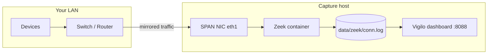

# Passive deployment: SPAN port and gateway

Vigilo analyzes Zeek `conn.log` files. In production you should capture traffic **passively** — no MITM, no ARP spoofing. The recommended paths are:

1. **Switch SPAN / mirror port** — copy all LAN traffic to a dedicated capture NIC
2. **Gateway Zeek** — run Zeek on pfSense, OPNsense, or your router and export logs

Both feed the same Zeek log format Vigilo already understands.

---

## Architecture



Traffic is **observed only** — Vigilo never sits in the forwarding path.

---

## Option A: Switch SPAN port (recommended)

### 1. Configure the mirror on your switch

Exact steps vary by vendor. General pattern:

| Switch type | Where to configure |
|-------------|-------------------|
| Managed L2 (Netgear, TP-Link, Ubiquiti) | Port mirroring / SPAN in switch UI |
| Cisco / enterprise | `monitor session` CLI |
| UniFi | Settings → Networks → Mirror port |

Mirror **all LAN ports** (or the ports where IoT/devices live) to a **dedicated capture port**. Connect that port to a spare NIC on your capture host — call it `eth1`.

The capture NIC should have **no IP address** and should not participate in routing. It only receives copies of packets.

### 2. Prepare the capture host

Requirements:

- Linux host with Docker
- Second NIC connected to the SPAN port (`eth1` or similar)
- Enough disk for Zeek logs (conn.log grows ~1–50 MB/day on a home LAN)

Identify the interface name:

```bash
ip link show
# or
sudo tcpdump -i eth1 -c 5   # should show LAN traffic if SPAN is working
```

### 3. Start Vigilo with the SPAN profile

```bash
cp .env.span.example .env
# Edit CAPTURE_IFACE if your mirror NIC is not eth1
mkdir -p data/zeek checkpoints/demo reports

docker compose --profile span up -d
```

This starts:

- **zeek** — listens on `CAPTURE_IFACE`, writes `data/zeek/conn.log`
- **vigilo** — dashboard at http://localhost:8088

Verify Zeek is writing logs:

```bash
ls -la data/zeek/conn.log
tail -3 data/zeek/conn.log
```

### 4. Train on your network

The bundled demo checkpoint lets you verify the dashboard immediately. For real alerts, train on **your** benign traffic after 1–24 hours of capture:

```bash
docker compose run --rm --profile tools train \
  --logs /app/data/zeek/conn.log \
  --output-dir /app/checkpoints/vigilo
```

Update `.env`:

```ini
VIGILO_CKPT=checkpoints/vigilo/vigilo.pt
VIGILO_LOG=data/zeek/conn.log
```

Restart:

```bash
docker compose --profile span up -d
```

---

## Option B: Gateway Zeek (pfSense / OPNsense)

If your firewall already runs Zeek (or can), skip the Zeek container entirely.

### pfSense / OPNsense

1. Enable the Zeek package on the gateway
2. Configure Zeek to log connections (`conn.log`)
3. Copy or mount the log to your Vigilo host:

```bash
# Example: rsync from gateway every 5 minutes
rsync -az gateway:/var/log/zeek/current/conn.log ./data/zeek/conn.log
```

4. Run Vigilo without the span profile:

```bash
cp .env.example .env
# Set VIGILO_LOG=data/zeek/conn.log
docker compose up -d vigilo
```

For near-live analysis, cron the rsync and refresh the dashboard, or run Vigilo on the gateway itself if it has enough CPU/RAM.

---

## Option C: Bettercap MITM (lab / last resort)

If you cannot mirror traffic and do not control the gateway, Vigilo includes Bettercap scripts for **your own lab network only**:

```bash
sudo bash scripts/bettercap_monitor.sh 300
```

This is **disruptive** (ARP spoofing, LAN bottleneck). Prefer SPAN or gateway Zeek in any production or shared environment. See `scripts/bettercap_monitor.sh` for warnings.

---

## Environment reference

| Variable | SPAN default | Description |
|----------|--------------|-------------|
| `CAPTURE_IFACE` | `eth1` | NIC receiving mirrored traffic |
| `VIGILO_LOG` | `data/zeek/conn.log` | Zeek conn.log path |
| `VIGILO_CKPT` | `checkpoints/demo/vigilo.pt` | Trained model |
| `VIGILO_PORT` | `8088` | Dashboard port |

Copy `.env.span.example` to `.env` before starting.

---

## Troubleshooting

**No traffic on SPAN NIC**

- Confirm mirror source ports include the devices you expect
- Verify cable is in the **destination** mirror port, not a normal access port
- Run `sudo tcpdump -i eth1 -c 20` — you should see IPs from your LAN

**Empty conn.log**

- SPAN may be mirroring only one direction; most switches mirror both — check switch docs
- Some Wi-Fi-only traffic never hits a wired SPAN; mirror the AP uplink or run Zeek on the AP/gateway

**Dashboard shows no devices**

- Wait for Zeek to accumulate flows (a few minutes)
- Ensure `VIGILO_LOG` points to the active conn.log
- Train a checkpoint on your network's benign traffic — the demo model may not match your feature distribution

**Permission errors on Zeek container**

- Zeek needs `NET_RAW` and `network_mode: host` — already set in `docker-compose.yml` span profile
- On SELinux hosts, label the data volume or set `privileged: true` temporarily for debugging

---

## Quick reference

```bash
# Demo (no SPAN hardware needed)
cp .env.example .env && docker compose up -d

# Passive SPAN deployment
cp .env.span.example .env
docker compose --profile span up -d

# View dashboard
open http://localhost:8088

# Stop
docker compose --profile span down
```
